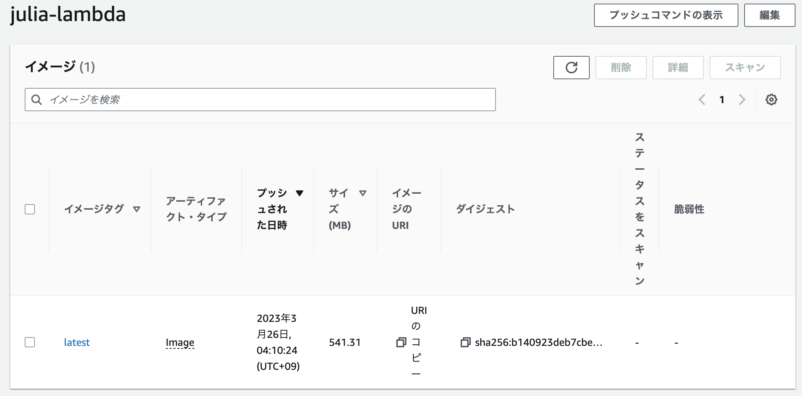
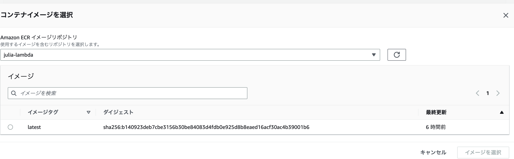
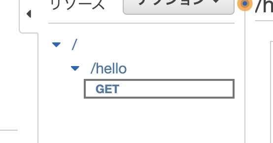
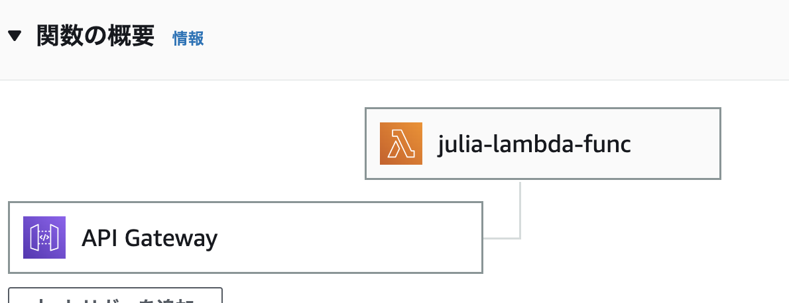

# Lambda + API GatewayでJuliaのAPIサーバーを公開する

---

## 1. はじめに

- 塚本真人
- 株式会社Fusic
- 普段はRoRでweb開発したり、Pythonで数理モデルの開発したりしてます
- github: https://github.com/TsuMakoto
- Twitter: @mako_tsuka
- jl.devというユーザーグループで管理人しています
  - https://jldev.connpass.com
  - Discord: https://discord.gg/NwTE3yg

--

### 1.1 本資料の目的

- Juliaを使ったAWS Lambdaの利用方法
- AWS LambdaとAPI Gatewayを連携

---

### 2 AWS Lambdaとは？

AWS Lambdaとは、トリガーを設定することで、自動的にコードを実行できるAWSのサービス

- サーバーレス
- スケーラブル
- コードの実行時間と使用されたメモリ量に基づいて課金(無料枠あり)
- ログ記録が可能

--

### 2.1 今回つくるもの

トリガーには、

- S3へのファイルアップロード
- API Gatewayのリクエストなど

=> 今回は、httpリクエストでトリガーさせ、APIサーバーをつくります。

---

## 3. 事前準備: Dockerイメージを作成

--

### 3.1 AWS Lambdaのサポート環境

C++、Go、Java、Node.js、Python、Ruby

=> Juliaはない！

--

### 3.2 カスタムランタイム

https://gallery.ecr.aws/lambda/provided

Dockerイメージを作成して、自分で環境を用意する必要があります。

参考コード： https://github.com/tk3369/aws-lambda-container-julia

---

## 4. Lambda + API GatewayでJuliaのAPIサーバーを公開する手順

1. IAMで実行可能ユーザーを作成
2. Dockerイメージを作成
3. DockerイメージをECRへpush
4. Lambda関数を作成する
5. API Gatewayを作成する
6. Lambda関数とAPI Gatewayを紐付ける
7. API Gatewayのデプロイ

--

### 4.1 DockerイメージをECRへpush
ECRはDockerイメージのレジストリ


--

### 4.2 ECRへログイン+push

```bash
# リポジトリの作成
aws ecr create-repository --repository-name julia-lambda

# ECRへログイン
aws ecr get-login-password --region us-west-2 | docker login --username AWS --password-stdin [AWSアカウントID].dkr.ecr.us-west-2.amazonaws.com

# タグ付け
docker tag julia-lambda:latest [AWSアカウントID].dkr.ecr.us-west-2.amazonaws.com/julia-lambda:latest

# push!
docker push [AWSアカウントID].dkr.ecr.us-west-2.amazonaws.com/julia-lambda:latest
```

--

### 4.3 Lambda関数の作成
さっき作ったイメージを使う


```bash
aws lambda create-function --function-name julia-lambda-func --image-uri [AWSアカウントID].dkr.ecr.us-west-2.amazonaws.com/julia-lambda:latest --role [lambdaを実行できるrole] --package-type Image

```

--

### 4.4 API Gatewayを作成
APIを簡単に構築し、デプロイすることができる



```bash
# API作成
aws apigateway create-rest-api --name julia-api

# リソースの作成
aws apigateway create-resource --rest-api-id [API ID] --parent-id [親リソースID] --path-part hello

# リソースにメソッドを追加する
aws apigateway put-method --rest-api-id [API ID] --resource-id [helloのリソースID] --http-method GET --authorization-type "NONE" --no-api-key-required

```

--

### 4.5 Lambda関数とAPI Gatewayを紐付け



```bash
# APIGateway ==> Lambda
aws lambda add-permission --function-name julia-lambda-func --statement-id apigateway --action lambda:InvokeFunction --principal apigateway.amazonaws.com --source-arn "arn:aws:execute-api:us-west-2:[AWSアカウントID]:[API ID]/*/GET/hello"

# Lambda ==> APIGateway
aws apigateway put-integration --rest-api-id [API ID] --resource-id [リソースID] --http-method GET --type AWS_PROXY --integration-http-method POST --uri arn:aws:apigateway:us-west-2:lambda:path/2015-03-31/functions/arn:aws:lambda:us-west-2:[AWSアカウントID]:function:julia-lambda-func/invocations

```

--

### 4.6 デプロイ
```bash
aws apigateway create-deployment --rest-api-id [API ID] --stage-name dev
```

---

## 5. APIへアクセス

--

### 5.1 実行する関数

```julia
module JuliaLambdaFunc

using JSON

function lambda_handler(body, headers)
    body = JSON.json(Dict("message" => "Hello, world!"))
    headers = Dict("Content-Type" => "application/json")
    return JSON.json(Dict("statusCode" => 200, "headers" => headers, "body" => body))
end

end

```

--

### 5.2 アクセス

`https://[API ID].execute-api.us-west-2.amazonaws.com/dev/hello`


---

## 6. サンプルについて

--

- https://github.com/TsuMakoto/JuliaTokai14/blob/main/scripts/create.sh

- ここに今回のサンプルをおいてるので、参考にどうぞ

---

## 7. おわり!!

JuliaでAPIサーバーの公開ができた！


